# Crazy Test 平台

## 简介

Crazy Test 是一个开源的测试平台，可以快速搭建测试平台支持接口用例、场景用例执行并生成测试报告。

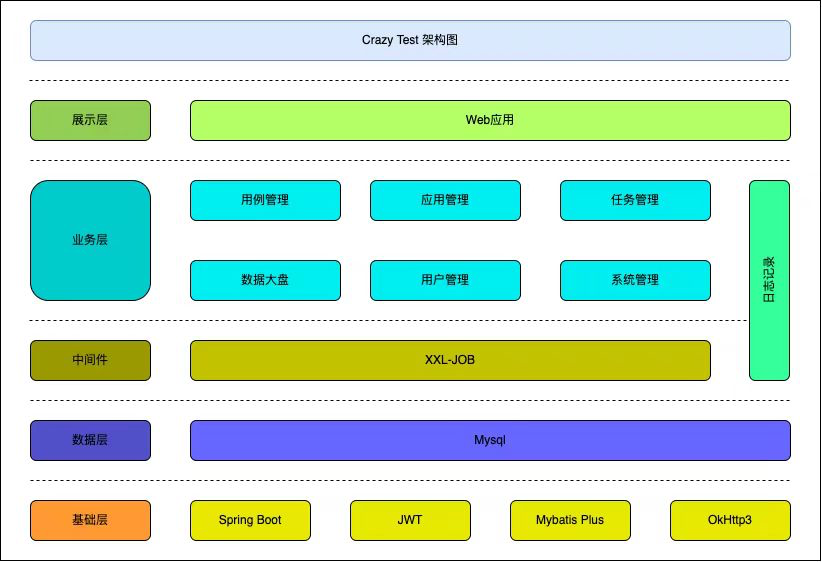

## 代码地址

- [前端：点击查看](https://github.com/crazy0261/crazy-test-ui.git)
- [后端：点击查看](https://github.com/crazy0261/crazy-test.git)

## 环境

- 前端：React + Antd + Antd Pro + AntV
- 后端：Spring Boot + MyBatis

## 部署

- node

## 步骤

1. 下载源码

2. 打包

3. 安装 docker

4. Dockerfile (其他方式也可实现) 赋予权限 chmod 777 Dockerfile

- 构建 docker build -t crazy:1.0 .

5. 启动及运行容器

- docker run -d --name crazy-test -p 8080:8080 crazy-test:latest

6. 配置文件

- 路径（/etc/nginx/conf.d）
- 修改完成需要重启，也可以直接配置文件呢 copy 到容器
- default.conf

```shell
server {
    # 端口
    listen       8888;
    listen  [::]:8888;
    server_name  localhost;

    #access_log  /var/log/nginx/host.access.log  main;

    location / {
        root   /usr/share/nginx/html;
        index  index.html index.htm;
    }

    # 配置 代理。以下去去掉/crazy
    location /crazy/ {
        rewrite ^/crazy/(.*)$ /$1 break;
        # 后端服务
        proxy_pass http://124.222.106.11:8080;
        # 传递请求头
        proxy_set_header Host $host;
        proxy_set_header X-Real-IP $remote_addr;
        proxy_set_header X-Forwarded-For $proxy_add_x_forwarded_for;
        proxy_set_header X-Forwarded-Proto $scheme;
    }

    #error_page  404              /404.html;

    # redirect server error pages to the static page /50x.html
    #
    error_page   500 502 503 504  /50x.html;
    location = /50x.html {
        root   /usr/share/nginx/html;
    }

    # proxy the PHP scripts to Apache listening on 127.0.0.1:80
    #
    #location ~ \.php$ {
    #    proxy_pass   http://127.0.0.1;
    #}

    # pass the PHP scripts to FastCGI server listening on 127.0.0.1:9000
    #
    #location ~ \.php$ {
    #    root           html;
    #    fastcgi_pass   127.0.0.1:9000;
```

- 安装依赖
-     npm run i
- 运行地址 http://localhost:8000/
- 账号/密码 admin/admin

## 页面

1. 登录 
2. 接口用例 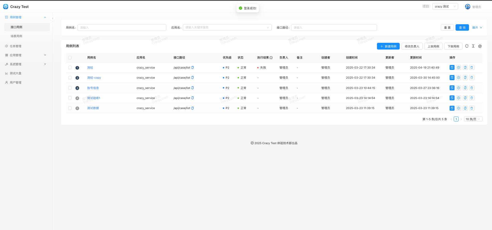
3. 接口用例执行 
4. 场景用例 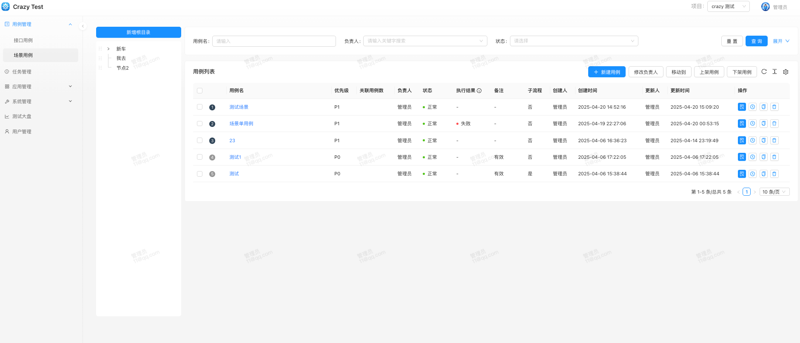
5. 场景用例执行 
6. 定时任务 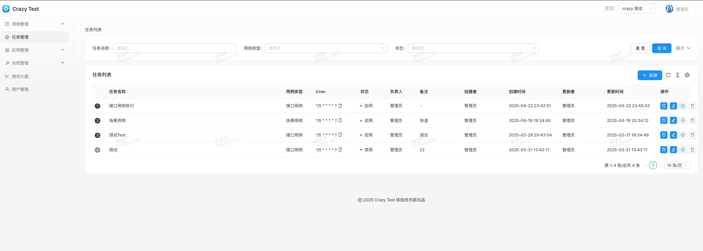
7. 定时任务详情 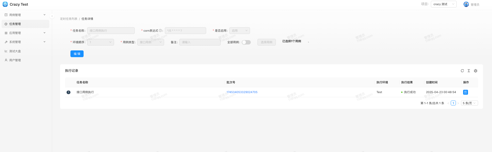
8. 应用管理 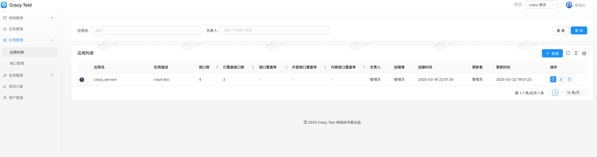
9. 接口管理 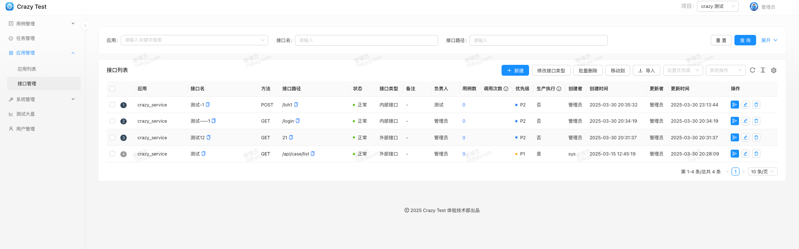
10. 系统管理-数据源管理 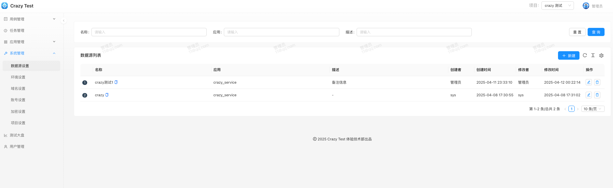
11. 系统管理-环境设置 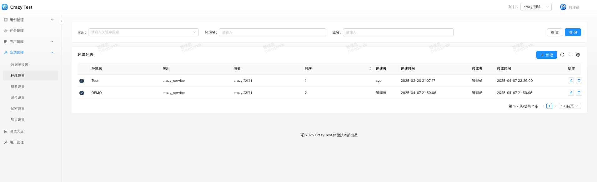
12. 系统管理-域名设置 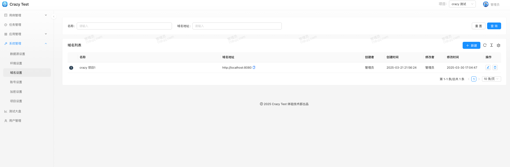
13. 系统管理-账号设置 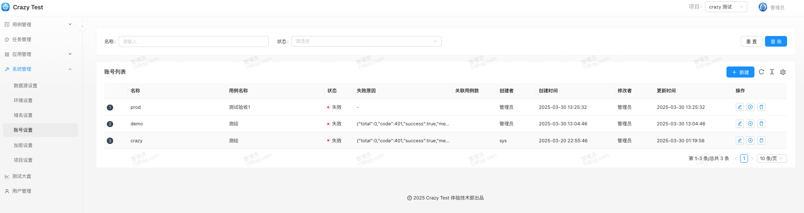
14. 系统管理-加密设置 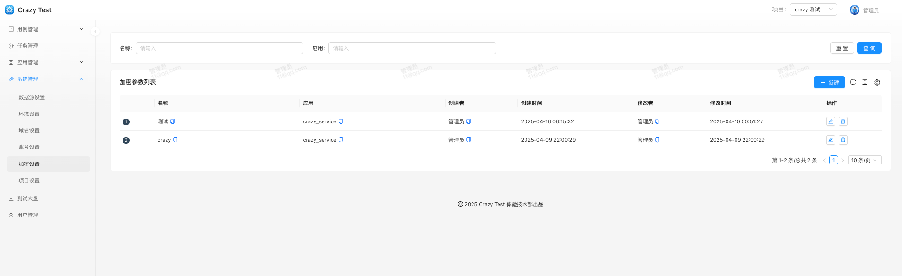
15. 系统管理-项目设置 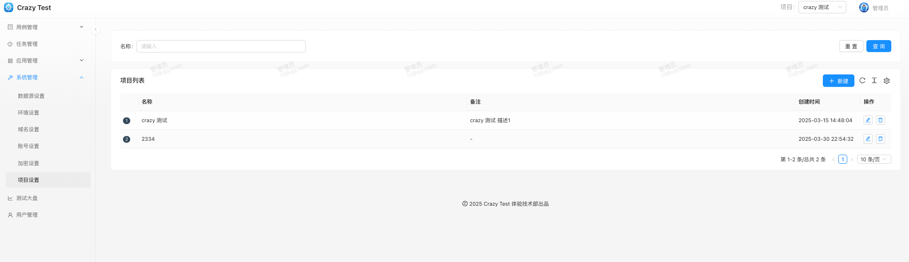
16. 用户管理 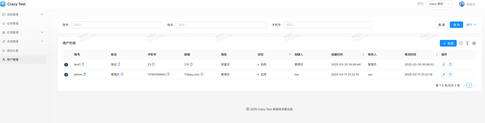
17. 数据大盘 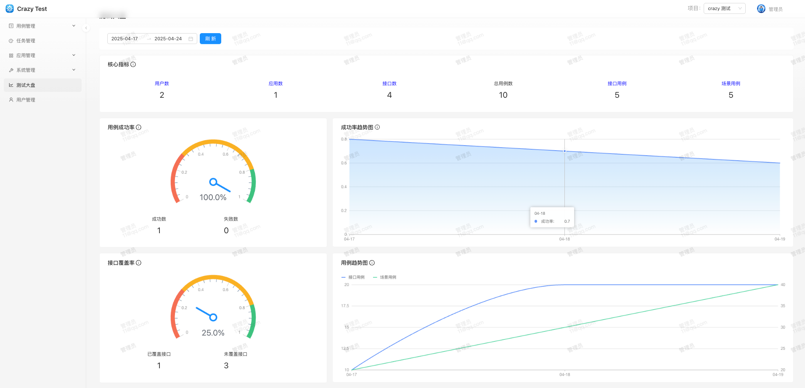  
